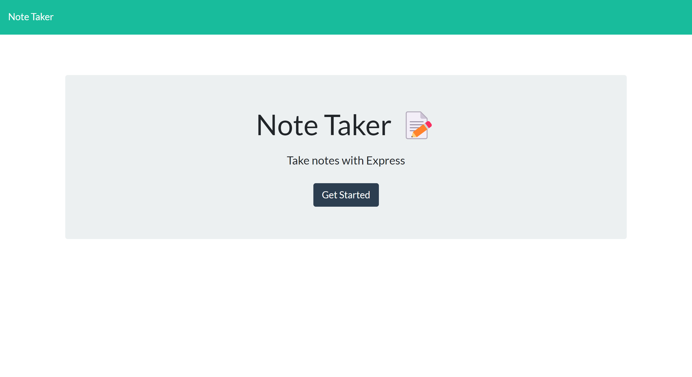
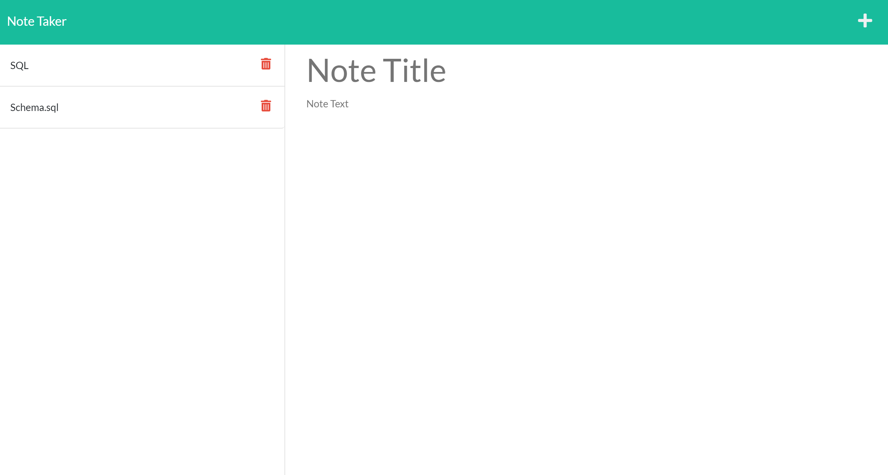

# Note Tracker

## Deployed Application
https://esrawameed.github.io/App-Weather-Forecast/
## Description
This application was created to allow users to have a place where they could keep their thoughts and tasks organized by creating and saving as many notes as they'd like. Users could also choose to delete those notes once complete.
## features
- Ability to add notes.
- Ability to save notes.
- Ability to delete notes.
## Technologies Used
- HTML: to display page and page strucute.
- CSS: to integrate styling to the application.
- javascript: to add functionality and local storage.
- node.js: back-end javaScript runtime environment.
- Express.js: framework for building applications.
- uuid: generate unique id for notes.

## Credits
© 2022 Trilogy Education Services, LLC, a 2U, Inc. brand. Confidential and Proprietary. All Rights Reserved.

